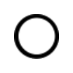
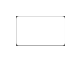
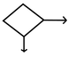
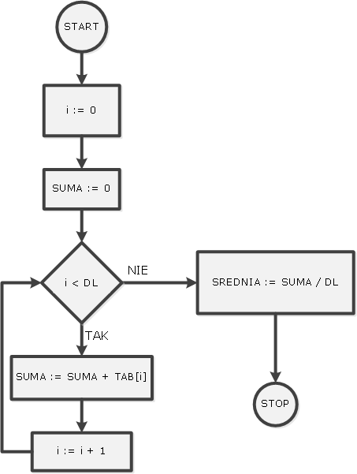

 Diagramy
==========

Algorytmy można zapisywać na wiele sposobów. Zwykle zapisuje się je (implementuje) w jakimś języku programowania,
niektórzy używaja tzw. pseudo-kodu. Innym sposobem jest wyrażenie algorytmu w postaci diagramu.

Proponujemy następującą notację diagramów, która składa się z takich elementów:
<table>
 <tr> <th>   START </th> <td> początek programu, może być tylko jeden w całym diagramie. </td> </tr>
 <tr> <th>  STOP </th> <td> koniec programu, może występować wiele razy. </td> </tr>
 <tr> <th>  </th> <td> podstawowa instrukcja przypisania wartości. Wewnątrz prostokątu pisze się przypisanie, np. 
<br/>`a := 3` podstawia wartosc "3" pod nazwe "a", 
<br/>a z kolei `b := a+1` ustawia nazwe "b" na wartosc o jeden wieksza niz jest w "a",
<br/>`el := TAB[i]` bierze element z tablicy TAB pod numerem `i` i wpisuje go pod nazwę "el" itp. </td> </tr>
 <tr> <th>  </th> <td> podaje się jeden warunek np. `x > 3`, dodatkowo z tego elementu wychodzą dwie strzałki "TAK" oraz "NIE" - reprezentujące co ma się dziac jeśli warunek jest spełniony, a co jeśli nie. </td> </tr>
 <tr> <th> strzałki łączące elementy diagramu </th> <td> z jednego elementu może wychodzić tylko jedna strzałka (z wyjątkiem warunków - tam dwie), do jednego elementu może wchodzić potencjalnie wiele strzałek. </td> </tr>
</table>

 Cel
=====

Używając elementów diagramu opisanych powyżej, stwórz program (diagram), ktory rozwiązuje zadanie opisane poniżej.

Sposób wyrażenia diagramu jest dowolny. Można uzyć jakiegoś programu komputerowego do rysowania, ale równie dobrze można 
narysować na kartce i zrobić zdjęcie rysunku.

 Zadanie
=========

Jest dana tablica TAB oraz jej długość DL. Tablica zawiera cyfry od 1 do 9. Cyfry mogą występować dowolnie w tablicy, na przykład tablica może mieć postać [8,8,2,5,3,1,4,6,7,5]. 
Oprócz tego dane sa dwie dodatkowe cyfry C1 i C2 (też od 1 do 9) np C1=8 C2=2.
Napisac program, który dla zadanej tablicy TAB, jej długości DL, oraz dwóch cyfr C1 i C2 sprawdzi, czy w tablicy TAB występuje cyfra C1 i bezpośrednio po niej C2.

Przykład 1:
``` 
TAB=[8,8,2], DL=3, C1=8, C2=2 
```
wynik będzie TAK, gdyż w tablicy występuje cyfra 8 i bezpośrednio po niej cyfra 2.

Przykład 2: 
```
TAB=[2,2,3], DL=3, C1=2, C2=2 
```
wynik będzie TAK, gdyż w tablicy występuje cyfra 2 i bezpośrednio po niej cyfra 2.

Przykład 3:
```
TAB=[4,2,3,7], DL=4, C1=4, C2=3 
```
wynik będzie NIE, gdyż za cyfrą 4 nie występuje bezpośrednio cyfra 3.

Przykład 4:
```
TAB=[7,4,3,5,4,2,6,8,8,1], DL=10, C1=4, C2=2 
```
wynik będzie TAK, gdyż w tablicy występuje cyfra 4, po której bezpośrednio występuje cyfra 2.


 Przykład 
==========

Ponizszy diagram jest przykladowym rozwiazaniem *innego* zadania.

Zadanie:

```
Dana jest tablica liczb o nazwie TAB o dlugosci DL. 
Stworzyc program, ktory wylicza srednia arytmetyczna z liczb w tej tablicy.
```




